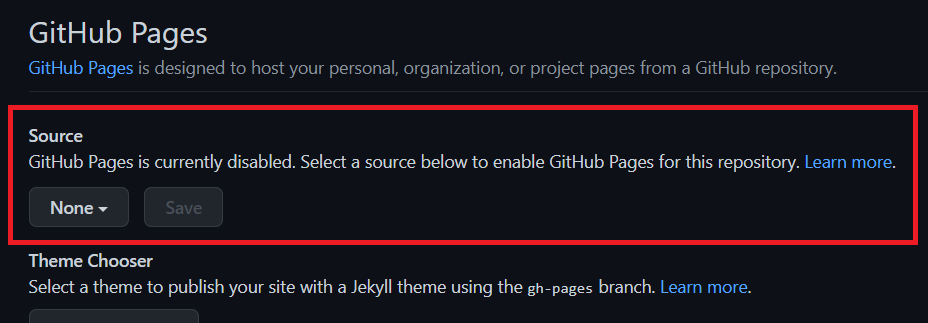
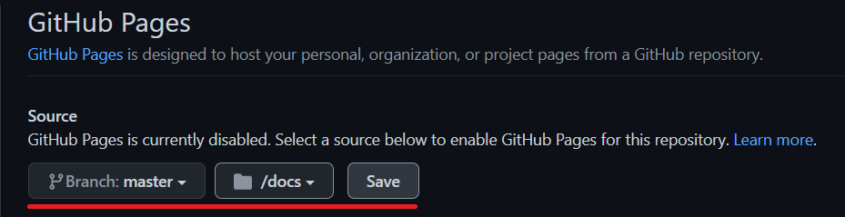

# vite-vue-router-tailwind-test

## 作成方法

### Step.0 Node.js・npm・yarn のインストール

私はVoltaというバージョン管理ツールでインストールしました．

Voltaでのインストールは，[こちら](https://zenn.dev/taichifukumoto/articles/how-to-use-volta)を参考にしました．

使用環境

- OS: Windows 10 Home
- Volta: v1.0.5
- Node: v16.13.0
- npm: v8.1.4
- Yarn: v1.22.17

### Step.1 プロジェクト作成

yarn で vite のプロジェクトを作成し，
ルートディレクトリをそのプロジェクトに変えます．
そのあと，`yarn install` で yarn をインストールします．

まとめると，

```shell
yarn create @vitejs/app [プロジェクト名]
```

(質問は `vue` → `vue-ts` と答えます．)

```shell
cd [プロジェクト名]
```

```shell
yarn install
```

となります．今回は，

```shell
yarn create @vitejs/app vite-vue-router-tailwind-test
```

(質問は `vue` → `vue-ts` と答えます．)

```shell
cd vite-vue-router-tailwind-test
```

```shell
yarn install
```

です．

プロジェクト名が長いので，今後は

```shell
[プロジェクト名] = vite-vue-router-tailwind-test
```

とします．適宜読み替えてください！

ここで，

```shell
yarn dev
```

を入力し，`localhost:3000` でViteプロジェクトができたことを確認するといいと思います．
(確認できたらコマンドラインで `Ctrl` + `C` を押しましょう．)

### Step.2 必要パッケージのインストール

```shell
yarn add vue-router@4 vuex axios
```

```shell
yarn add -D sass scss scss-loader
```

を入力してパッケージをインストールします．

(vuex と axios に関して，今回必要であるのかどうかはわかりませんでした．)

### Step.3 ディレクトリ構成

`src` ディレクトリに

- `router.ts`
- `views` ディレクトリ

を追加します．
そして，`views` ディレクトリに

- `About.vue`
- `Home.vue`

を追加します．

すると，次のようなディレクトリ構造になると思います．

```tree
root
|   .gitignore
|   index.html
|   package.json
|   README.md
|   tsconfig.json
|   vite.config.ts
|   yarn.lock
|
+---node_modules
|       # 略
|
+---public
|       favicon.ico
|
\---src
    |   App.vue
    |   env.d.ts
    |   main.ts
    |   router.ts       # 追加
    |
    +---assets
    |       logo.png
    |
    +---components
    |       HelloWorld.vue
    |
    \---views           # 追加
            About.vue   # 追加
            Home.vue    # 追加
```

### Step.4 Routerの導入

`src` ディレクトリ下の

- `src/main.ts`
- `src/App.vue`
- `src/router.ts`
- `src/views/Home.vue`
- `src/views/About.vue`

の5つのファイルをそれぞれ次のように変更します．

#### `src/main.ts`

```diff
import { createApp } from 'vue'
+  import router from './router'
import App from './App.vue'

-  createApp(App).mount('#app')
+  createApp(App).use(router).mount('#app')
```

すなわち

```ts
import { createApp } from 'vue'
import router from './router'
import App from './App.vue'

createApp(App).use(router).mount('#app')
```

#### `src/App.vue`

```diff
-  <script setup lang="ts">
-  // This starter template is using Vue 3 <script setup> SFCs
-  // Check out https://v3.vuejs.org/api/sfc-script-setup.html#sfc-script-setup
-  import HelloWorld from './components/HelloWorld.vue'
-  </script>

<template>
-    
-    <HelloWorld msg="Hello Vue 3 + TypeScript + Vite" />
+  <div id="nav">
+    <router-link to="/">Home</router-link> |
+    <router-link to="/hoge">Hoge</router-link>
+  </div>
+  <router-view/>
</template>


<style>
#app {
  font-family: Avenir, Helvetica, Arial, sans-serif;
  -webkit-font-smoothing: antialiased;
  -moz-osx-font-smoothing: grayscale;
  text-align: center;
  color: #2c3e50;
  margin-top: 60px;
}

+  #nav {
+    padding: 30px;
+  }
+
+  #nav a {
+    font-weight: bold;
+    color: #2c3e50;
+  }
+
+  #nav a.router-link-exact-active {
+    color: #42b983;
+  }

</style>
```

すなわち

```vue
<template>
  <div id="nav">
    <router-link to="/">Home</router-link> |
    <router-link to="/about">About</router-link>
  </div>
  <router-view/>
</template>

<style>
#app {
  font-family: Avenir, Helvetica, Arial, sans-serif;
  -webkit-font-smoothing: antialiased;
  -moz-osx-font-smoothing: grayscale;
  text-align: center;
  color: #2c3e50;
  margin-top: 60px;
}

#nav {
  padding: 30px;
}

#nav a {
  font-weight: bold;
  color: #2c3e50;
}

#nav a.router-link-exact-active {
  color: #42b983;
}
</style>
```

#### `src/router.ts`

```ts
import Vue from 'vue';
import * as VueRouter from 'vue-router';
import { createRouter, createWebHistory } from 'vue-router'
// HomeビューとAboutビューのインポート
import Home from './views/Home.vue';
import About from './views/About.vue';

const routes = [
  {
    path: '/',
    component: Home  // Homeビュールーティング
  },
  {
    path: '/about',
    component: About  // Aboutビュールーティング
  },
]

const router = createRouter({
  history: createWebHistory(import.meta.env.BASE_URL),
  routes,
});

export default router;
```

#### `src/views/Home.vue`

```vue
<template>
  <div class="home">
    
    <HelloWorld msg="Welcome to Your Vue.js App" />
  </div>
</template>

<script lang="ts">
// @ is an alias to /src
import HelloWorld from "../components/HelloWorld.vue";

export default {
  name: "Home",
  components: {
    HelloWorld,
  },
};
</script>
```

##### `src/views/About.vue`

```vue
<template>
  <div class="about">
    <h1>This is About page</h1>
  </div>
</template>
```

ここまでを変更すれば，Routerの追加ができたと思います．

### Step.4.5 GitHub Pages で公開する

一度ここで，GitHub Pages で投稿してみましょう．

まず，`./vite.config.ts` を次のように変更します．

```diff
import { defineConfig } from 'vite'
import vue from '@vitejs/plugin-vue'

// https://vitejs.dev/config/
export default defineConfig({
  // 本番時はgithubリポジトリをルートパスにする
+  base: (process.env.NODE_ENV === 'production')
+    ? '/[プロジェクト名]/' : './',
+  build: {
+    outDir: 'docs'
+  },
  plugins: [vue()]
})
```

すなわち

```ts
import { defineConfig } from 'vite'
import vue from '@vitejs/plugin-vue'

// https://vitejs.dev/config/
export default defineConfig({
  // 本番時はgithubリポジトリをルートパスにする
  base: (process.env.NODE_ENV === 'production')
    ? '/[プロジェクト名]/' : './',
  build: {
    outDir: 'docs'
  },
  plugins: [vue()]
})
```

とします．

そのあと，コマンドラインで次を実行します．

```shell
yarn build
```

すると，`docs` フォルダができ，`index.html` 等が作成されたかと思います．

次に，GitHub の設定をします．
GitHubにPushしていない人はこのタイミングでしておきましょう．

次の手順でGitHub Pages を有効にします．

1. GitHub のレポジトリページの `Setting` に移ります．
2. 左側のタブから `Pages` を選択します．
3. 下の写真(一枚目) の `None` を `master` に，その後出てくる `📁/(root)` を `docs` に変更して保存します(写真二枚目)．   `Save` を押して保存します． 
4. 下の方にある `Enforce HTTPS` にチェックが付いていなければチェック☑します．

これでしばらく待つと，指定されたURLで今回のページを見ることができます．

### Step.5 TailWind の導入

## 参考記事

- [Vue3系+TS+Vite を使った0からのSPA開発【 [序章] 環境構築編】](https://qiita.com/OhDyla/items/b6924ce1f94f5532dbab)
- [vite + vue3 + typescriptでgithub pagesにサイトを公開しよう](https://qiita.com/taka_1156/items/ec0a7ccbfcefd976d32c)
- [【WEB開発】Vue.js + TailWind CSS 導入編](https://zenn.dev/grimm_marchen/articles/8d297bf7ea1127)
- [Install Tailwind CSS with Vue 3 and Vite](https://tailwindcss.com/docs/guides/vue-3-vite)
